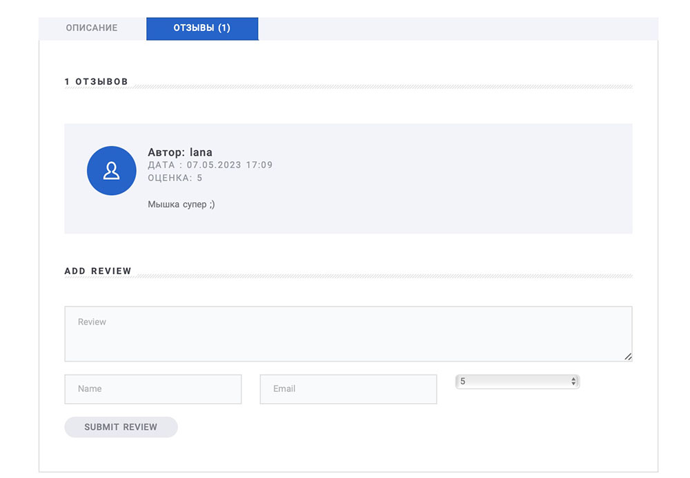
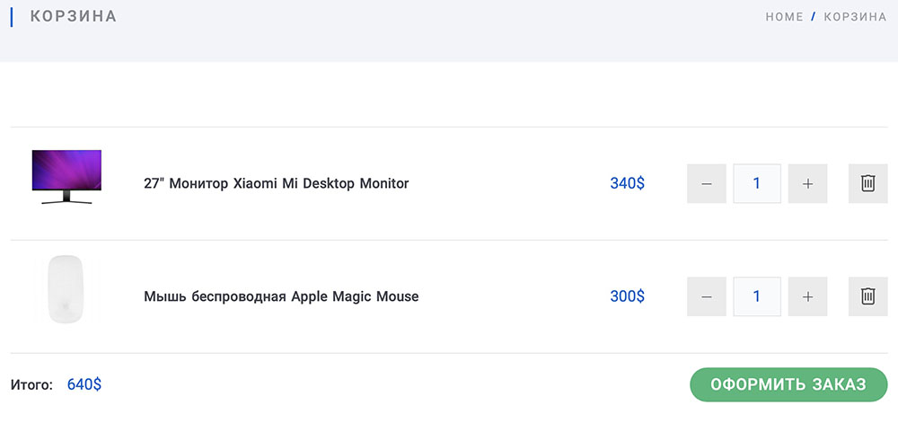
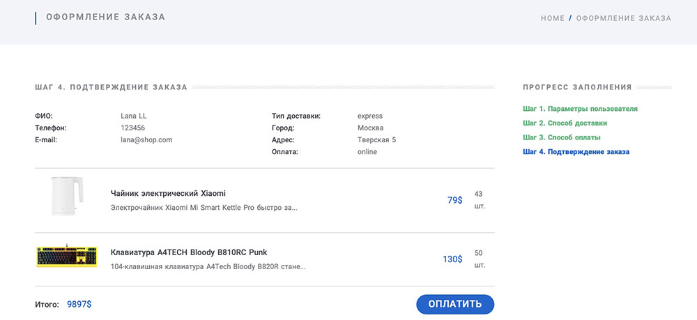

# Интернет-магазин MEGANO

## Что из себя представляет проект

Предтаавляет собой интернет магазин, в котором django-приложение берет на себя все что связано с отобоажением страниц, а обращение
за данными происходит по API, который реализоваy в ходе проекта.

#### Главная страница

#### Продолжение главной страници

## Подключение

1. Клонировать или скачать проект.
2. Уствновить rquirements.txt, выполнив команду:
   `pip install -r requirements.txt`
3. Выполнить миграции.
4. По желанию загрузить фикстуры:
   `python manage.py loaddata app_catalog/fixtures/initial_data.json`
   `python manage.py loaddata app_catalog/fixtures/initial_data.json`
   `python manage.py loaddata app_catalog/fixtures/initial_data.json`
   `python manage.py loaddata app_catalog/fixtures/initial_data.json`
5. Запустить сервер разработки: `python manage.py runserver`, где по адресу `127.0.0.1:8000` должна открыться стартовая страница интернет-магазина с кликабельным интерфейсом.

## Структура сайта

* Административный раздел с добавлением и редакктированием
* Главная страница.
  * Три избранные категории товаров
  * Популярные товары
  * Ограниченный тираж товаров
* Каталог с фильтром и сортировкой:
  * Сам каталог товаров.
  * Детальная страница товара, с отзывами.
* Оформление заказа:
  * Корзина.
    * Оформление заказа.
    * Оплата.
* Личный кабинет:
  * Профиль.
  * История заказов.

## Пример страниц

#### Карточка товара

#### Отзывы

#### Страница пользователя

#### Корзина

#### Поиск-фильр

#### Оформление заказа

